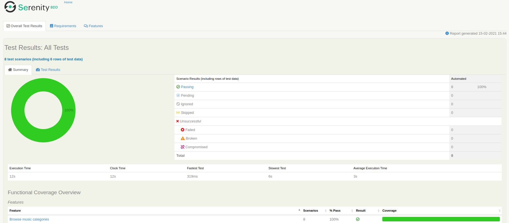
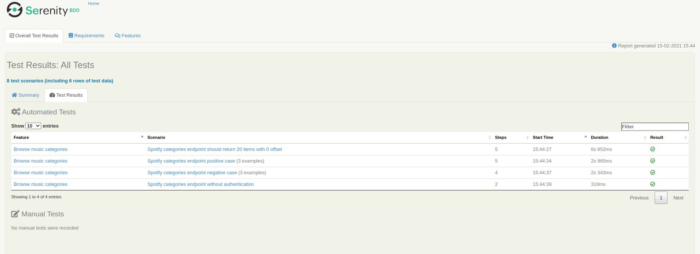
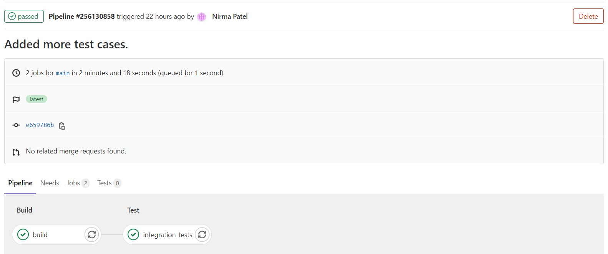
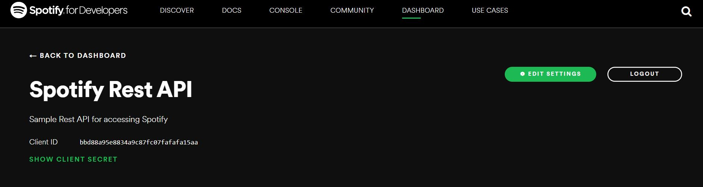

# Spotify REST API testing with Serenity and Cucumber

This tutorial show you how to get started with Spotify REST-API testing using Serenity and Cucumber.

## How to install, run the tests and generate Serenity report

You can run all the test-cases and generate full Serenity reports by running command `mvn clean verify`. You can see the
generated Serenity report at `/target/site/serenity/index.html`





You can see GitLab CI pipeline stages at `/.gitlab-ci.yml`



## Endpoint instructions and scenario coverage

Here, we automate `categories` endpoint of Spotify API. You can find more documents from below links.

- https://any-api.com/spotify_com/spotify_com/docs/API_Description
- https://developer.spotify.com/
- https://developer.spotify.com/documentation/web-api/reference/
- https://developer.spotify.com/documentation/web-api/reference/#endpoint-get-categories

### Way to get Authorization token using `https://accounts.spotify.com/api/token` endpoint

For calling most of the spotify API you need to pass Authentication header. And you can get Authentication token by
calling `https://accounts.spotify.com/api/token` endpoint.

In order to authorize you need to register your app with Spotify and you can get your `clientId` and `clientSecret` from that app.
You can get more details at https://developer.spotify.com/documentation/general/guides/authorization-guide/#client-credentials-flow.
You can create and register your app using https://developer.spotify.com/documentation/general/guides/app-settings/ instructions.
You can see your applications at https://developer.spotify.com/dashboard/applications with your Spotify credentials.



```Gherkin
    Given I authorize and received token
```

The glue code is responsible for orchestrating calls to a layer of more authorization-focused classes, which perform
the actual REST calls.

```java
    @Steps
    private AuthorizationStep authorizationStep;
    
    @Given("I authorize and received token")
    public void getAuthToken() {
            token = authorizationStep.getAuthorizationResponse()
            .then()
            .statusCode(HttpStatus.SC_OK)
            .extract()
            .jsonPath()
            .get("access_token");
        }
```
```java
    public Response getAuthorizationResponse() {

        String baseUrl =  EnvironmentSpecificConfiguration.from(environmentVariables).getProperty(SpotifyConstants.PROP_SPOTIFY_AUTH_BASE_URL);
        String tokenPath =  EnvironmentSpecificConfiguration.from(environmentVariables).getProperty(SpotifyConstants.PROP_SPOTIFY_AUTH_TOKEN_PATH);
        String clientId =  EnvironmentSpecificConfiguration.from(environmentVariables).getProperty(SpotifyConstants.PROP_SPOTIFY_AUTH_CLIENT_ID);
        String clientSecret =  EnvironmentSpecificConfiguration.from(environmentVariables).getProperty(SpotifyConstants.PROP_SPOTIFY_AUTH_CLIENT_SECRET);

        String base64Credentials = encodeBase64(clientId + ":" + clientSecret);

        String reqBody = "grant_type=client_credentials";

        return SerenityRest.given()
                .spec(getSpecification(baseUrl, tokenPath))
                .header(new Header(SpotifyConstants.HEADER_NAME_AUTHORIZATION, "Basic " + base64Credentials))
                .contentType("application/x-www-form-urlencoded")
                .body(reqBody)
                .when()
                .post();
    }
```
### scenarios of `https://api.spotify.com/v1/browse/categories` endpoint

1. Default Test

```Gherkin
    Scenario: Spotify categories endpoint should return 20 items with 0 offset
    Given I authorize and received token
    When I browse categories with parameters
    | country | NL |
    Then Should receive response with status 200
    And Response should contain below values
    | categories.limit  | 20 |
    | categories.offset | 0  |
    And Response should contains items less than or equals to total
```
2. Positive test-cases

```Gherkin
  Scenario Outline: Spotify categories endpoint positive case
    Given I authorize and received token
    When I browse categories with parameters
      | offset | <browseOffset> |
      | limit  | <browseLimit>  |
    Then Should receive response with status 200
    And Response should contain below values
      | categories.limit  | <browseLimit>  |
      | categories.offset | <browseOffset> |
    And Response should contains items less than or equals to total
    Examples:
      | browseOffset | browseLimit |
#      Minimum limit value = 1
      | 0            | 1           | 
#      Maximum limit value = 50
      | 0            | 50          |
      | 20           | 10          |
```
3. Negative test-cases

```Gherkin
  Scenario Outline: Spotify categories endpoint negative case
    Given I authorize and received token
    When I browse categories with parameters
      | offset | <browseOffset> |
      | limit  | <browseLimit>  |
    Then Should receive response with status 400
    And Response should contain below values
      | error.message | <message> |
    Examples:
      | browseOffset | browseLimit | message                                               |
      | -1           | 20          | Bad offset, offset must be greater than or equal to 0 |
#      Minimum limit value should not less than 1
      | 0            | 0           | Bad limit, limit must be larger than 0                |
#      Minimum limit value should not greater than 50
      | 0            | 51          | Invalid limit                                         |
```

4. Negative test-case without Authorization header

```Gherkin
  Scenario: Spotify categories endpoint without authentication
    When I browse categories with parameters and without token
    | country | NL |
    Then Should receive response with status 401
```

## How to write new test cases
1. If you want to add more test data for negative or positive scenarios of `categories` API endpoint then you can add more rows in `Examples:` section.
2. If you want to add test-cases for different Spotify endpoint then you should create a new feature file, Actions class and Steps class. You can see examples below.
    - src/test/resources/features/categories.feature
    - src/test/java/com/patel/nirma/spotify/steps/CategoriesActions.java
    - src/test/java/com/patel/nirma/spotify/steps/CategoriesStep.java